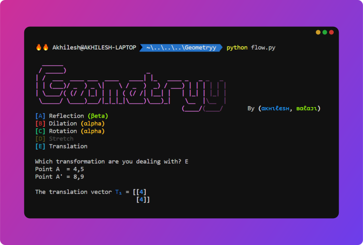

# Geometryy
<!-- ## A tool to accurately describe transformations on the Cartesian plane, given the image and pre-image coordinates. -->



The Cartesian Plane was popularized by René Descartes. In fact, the plane itself in named after him. It is defined by two perpendicular number-lines, called axes. In the Cartesian plane, a slice of Cartesian space, these two number lines are called  and  axes. Any point in the Cartesian plane can be uniquely described by two numbers—one that describes the point's vertical position, the  coordinate, and one that describes the point's horizontal position, the  coordinate. Thus, any point in the plane can be described by the set of numbers . Together, these two numbers that describe the object's position in the plane are called the object's coordinates.

An object may be transformed in the cartesian plane. Some common transformations include:
- Translation
- Reflection
- Dilation
- Rotation
- Stretches

There are set formulas for computing each of these transformations, and they can easily be done by computer programs such as GeoGebra or Desmos. However, it is quite a bit harder to describe a transformation given the object (pre-image) coordinates  and the image coordinates . This can be done manually, but it's a tedious process. Further, geometry tools such as GeoGebra do not have a feature to describe these transformations given  and .

This is why I developed Geometryy. Simply choose the transformation you feel is most likely to have occurred, feed it the image and object coordinates, and it describes the transformation assuming that  has been transformed to get . Some transformations might require the image and object of two points, as this requires simultaneously solving the equations of two lines to get a significant coordinate.

As of now, Geometryy is slightly buggy, due to there being multiple ways of describing a transformation in different scenarios (more on this later).

## Using Geometryy
Download the source-code from the releases page, extract the `.zip` to another folder. `cd` to the directory in your terminal and run `python flow.py`. There might be a few dependencies you need to install: `rich` for a colourful output and `numpy`. Install them with the following commands:
```
$ pip install rich
$ pip install numpy
```
Then run
```
$ python flow.py
```
Preferably, use a terminal that supports rich output such as the VSC integrated terminal or Windows Terminal.

Then, you will be presented with the screen shown in the screenshot at the top of the page. If you are using a terminal with rich output, the options will appear in different colours and option `[D] Stretches` will appear dimmer than the rest, as I have not completed work on it yet. The rest of the options will work, however.

Simply enter the letter next to the transformation, and press <kbd>Enter</kbd>. Now, enter the first object coordinate  and the first image coordinate . If it asks for  and , supply it with the second object and image coordinates. It doesn't matter if a shape, such as a triangle has been transformed—simply pick a few of the points, and enter them. If all goes well, it should describe the transformation.

If all *doesn't* go well, you have either encountered a bug, or you have provided a set of coordinates which have not gone through the same transformation, or the object coordinate, when that transformation is applied to it, cannot possibly map on to the image.

## How it works
### Translation
 is translated by a column vector , where  describes lateral movement and  represents the vertical movement of the point. Thus, to find the column vector that describes the translation of  to map it on to , one simply subtracts  from  (subtracting  from , and  from , where coordinates with subscript  belong to  and coordinates with subscript  belong to ).

### Reflection
When an object is reflected about a mirror line , its image will be the same distance from the mirror line as the object. Thus, the mirror line will be the perpendicular bisector of the line that connects  and .

### Rotation
The point of rotation  can be found by finding the point of intersection of the perpendicular bisectors of  and . The point of intersection can be found by simultaneously solving the equations of both bisectors. However, this method does not work is the perpendicular bisectors have the same equation. Then, the angle of rotation  can be found by computing the angle between  and . This angle, in radians, is simply

<div style="text-align:center">
</div>

where  and  are the slopes of  and . The value in radians can easily be converted to degrees.

### Dilation
The scale factor of the dilation can be found by dividing the length of one side of the image shape by the length of one side of the object shape.

<div style="text-align:center">
</div>

The centre of rotation is simply the point of intersection of the equations of  and , which can be achieved by simultaneously solving their equations.
